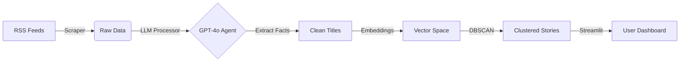

# 🛡️ No-Hype News: AI-Powered Clickbait Remover

[](https://no-hype-news.streamlit.app/)
[](https://www.python.org/)
[](https://openai.com/)
[](https://opensource.org/licenses/MIT)

### *An End-to-End Machine Learning Pipeline that reclaims your attention span.*

---

## 🚀 The Problem
Modern news feeds are optimized for **engagement**, not **information**. "Clickbait" headlines manipulate emotions (Fear, FOMO) to drive ad revenue, forcing users to "doomscroll" to find actual facts.

**The result?** Information overload and anxiety.

## 💡 The Solution
I built an automated AI pipeline that treats news as a data engineering problem. It doesn't just "flag" clickbait—it **fixes** it.

The system:
1.  **Scrapes** 1,300+ daily articles from major tech sources (The Verge, Wired, TechCrunch).
2.  **Clusters** duplicate stories using **Vector Embeddings (DBSCAN)** so you don't see the same story 10 times.
3.  **De-Hypes** headlines using an **LLM Agent**. It extracts the core fact and rewrites the title to be neutral and informative.

---

## ⚙️ Architecture Pipeline


### 🔍 Step-by-Step Pipeline Details

1.  **Ingestion (`scraper.py`):**
    * Fetches raw RSS feeds from 15+ high-volume tech sources.
    * Uses `BeautifulSoup` to clean HTML tags from descriptions.

2.  **Processing (`processor.py`):**
    * **Model:** OpenAI GPT-4o.
    * **Prompt Engineering:** Uses "Chain of Thought" prompting to force the model to identify the *exact* clickbait element (e.g., "This one trick") before rewriting it into a factual summary.

3.  **Clustering (`clusterer.py`):**
    * **Embeddings:** Converts titles to vector representations using `text-embedding-3-small`.
    * **Algorithm:** Uses **DBSCAN** (Density-Based Spatial Clustering). This groups semantically similar stories (e.g., 10 different articles about the same Apple event) without needing to know the number of clusters beforehand.

4.  **Deployment (`app_pro.py`):**
    * Hosted on Streamlit Cloud.
    * Updates automatically via **GitHub Actions** (CI/CD) whenever you trigger the workflow.
  
   ---

## 📸 Screenshots

### 1. The "De-Hyped" Dashboard
*The main feed filters out sensation. Notice the "Hype Score" on the right.*


### 2. AI Analysis & Transparency
*Clicking an article reveals exactly what the AI changed and why.*


---

## 🛠️ Tech Stack

* **Language:** Python 3.10
* **LLM Orchestration:** LangChain, OpenAI API
* **Data Engineering:** Pandas, BeautifulSoup, Feedparser
* **Machine Learning:** Scikit-Learn (DBSCAN), NumPy
* **Visualization:** Plotly Express, Streamlit
* **Automation:** GitHub Actions (CI/CD)

---

## 🏃‍♂️ How to Run Locally

Want to see the code in action? Follow these steps:

1.  **Clone the repo**
    ```bash
    git clone [https://github.com/rajatsoni136/no-hype-news.git](https://github.com/rajatsoni136/no-hype-news.git)
    cd no-hype-news
    ```

2.  **Install dependencies**
    ```bash
    pip install -r requirements.txt
    ```

3.  **Set up your secrets**
    Create a `.env` file in the root directory:
    ```bash
    echo "OPENAI_API_KEY=sk-proj-your-key-here" > .env
    ```

4.  **Run the pipeline**
    ```bash
    # 1. Fetch data
    python scraper.py
    
    # 2. Analyze with AI (Costs ~$0.02)
    python processor.py
    
    # 3. Group duplicates
    python clusterer.py
    ```

5.  **Launch the App**
    ```bash
    streamlit run app_pro.py
    ```

---

## 🤝 Contributing

This project is open-source. Feel free to open an issue if you find a bug or have a suggestion for a new feature (e.g., Sentiment Analysis).

**Connect with me on LinkedIn to discuss LLMs and Data Engineering!**
